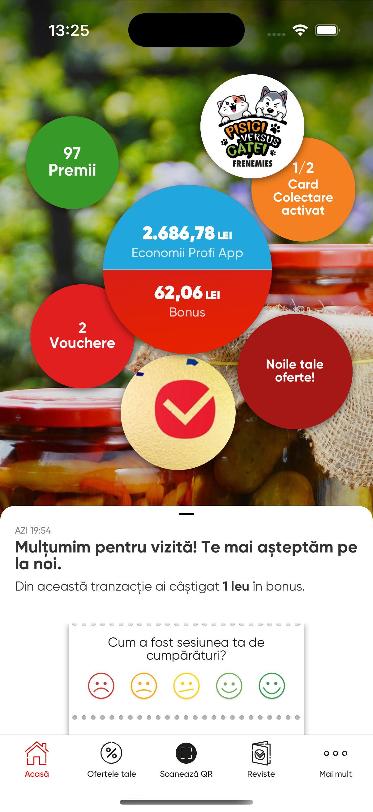
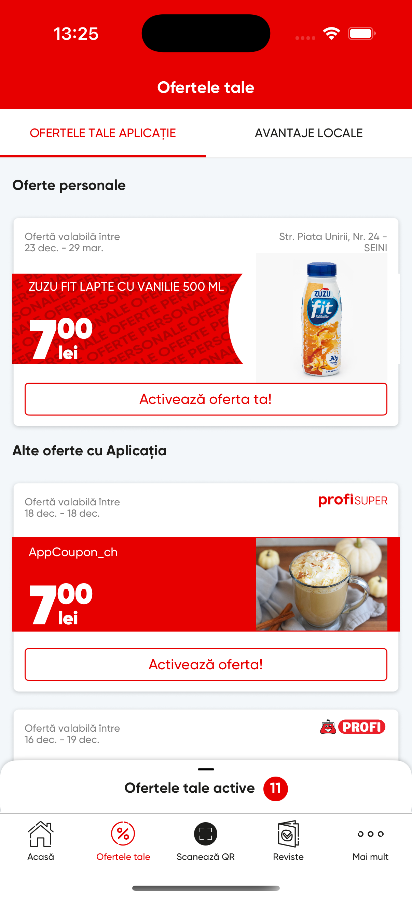

  

I'm an iOS / Swift Developer passionate about crafting intuitive and high-performance mobile applications. I focus on writing clean, maintainable code and continuously exploring new technologies to enhance user experiences.

---

## 🚀 About Me

- 🔭 Currently open to work as an iOS Developer.
- 🌱 Always learning and experimenting with SwiftUI, Combine, Async/Await, and more.
- 💬 Ask me about iOS development, custom UI components, or app architecture.
- 📫 Reach me via:  
  - **Email:** [croitorr@gmail.com](mailto:croitorr@gmail.com)  
  - **LinkedIn:** [Roman Croitor](https://www.linkedin.com/in/roman-croitor-92b0b6137)

---

## 💻 Experience

- **Lobyco SRL (Jun 2022 – Jan 2025)**
  - Spearheaded the development of robust iOS applications using UIKit/SwiftUI.
  - Focused on the seamless integration of the Profi app, enhancing its core functionalities and ensuring a unified user experience.
  - Engineered custom UI components and integrated modern features such as Async/Await and Combine.
  - Oversaw the full app lifecycle—from ideation and development to testing, deployment, and post-release monitoring.
  - Streamlined the release process using CI/CD pipelines, automated builds, and managed beta testing via TestFlight and App Store submissions.
  - Collaborated with cross-functional teams, leveraging CLEAN architecture and modular design to deliver high-performance apps.

- **Visiolink (Aug 2020 – Jun 2022)**
  - Played a key role in developing innovative mobile applications for digital communication and signage solutions.
  - Designed and implemented intuitive, responsive user interfaces using UIKit and Storyboards.
  - Integrated cloud-based APIs, enabling real-time content updates and efficient data synchronization.
  - Collaborated closely with UI/UX designers and backend engineers to develop and deploy user-centric features.

- **Freelance (Jan 2020 – Aug 2020)**
  - Developed independent iOS projects focused on delivering exceptional user experiences.
  - Managed all phases of app development—from concept and design to coding and deployment.

- **Socrates Strategies & Solutions (Apr 2019 – Dec 2019)**
  - Delivered tailored iOS solutions for diverse client requirements.
  - Worked closely with clients to understand their needs and translate them into robust mobile applications.

- **Debitare Indoire Sudura SRL (Apr 2013 – Feb 2019)**
  - Served as Chief Executive Officer, overseeing strategic planning and operational management.
  - Led technology initiatives to enhance digital presence and streamline business processes.

---

## 🛠️ Skills & Technologies

---

<h3 align="left">Languages and Tools:</h3>

  <table>
    <tr>
      <td align="center">
        
         Figma
      </td>
      <td align="center">
        
         Git
      </td>
      <td align="center">
        
         Postman
      </td>
      <td align="center">
        
         Sketch
      </td>
      <td align="center">
        
         Swift
      </td>
      <td align="center">
        
         Firebase
      </td>
      <td align="center">
        
         Jenkins
      </td>
      <td align="center">
        
         Azure
      </td>
      <td align="center">
        
         Jira
      </td>
    </tr>
  </table>

---

## 📸 Projects & Screenshots

### Profi App

Showcasing the Profi app I helped build:

  
  

*Tip: Place your Profi app screenshots in an `images` folder within your repository and update the file names if needed.*

---

## 📊 GitHub Stats

  

---

## 📫 Connect with Me

  
  
  

---

*Thanks for stopping by! Feel free to explore my repositories and projects.*
